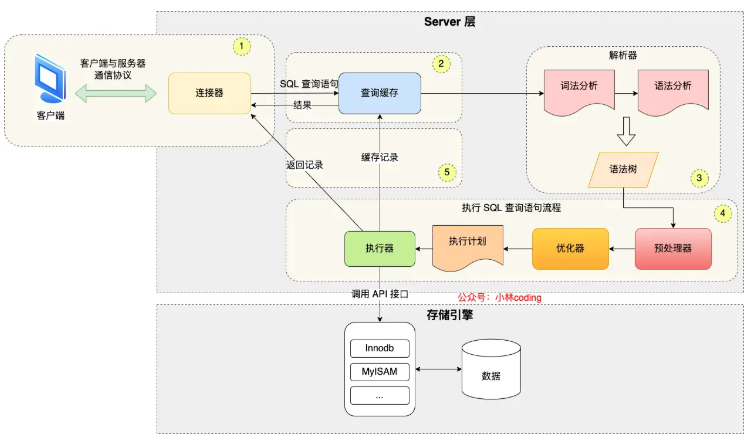

# MySQL 执行流程是怎样的



# 第一步：连接器

连接器（Connector）位于 MySQL 架构的最顶层，你可以把它看作是 MySQL 服务器的**“大堂经理”**或**“迎宾前台”**。

在 MySQL 的整体架构中，连接器挡在所有组件（解析器、优化器、执行器）之前。

它的作用可以总结为四个核心关键词：**握手、验证、鉴权、维持**。

------

### 1. 负责“握手” (建立连接)

这就回到了你刚才问的 TCP 知识。

- 当你使用 Java 代码（JDBC）或者命令行客户端发起连接请求时，连接器首先负责和客户端进行 **TCP 三次握手**。
- 只有 TCP 连接建立成功后，连接器才开始处理后续的 MySQL 协议交互。

### 2. 负责“验证” (身份认证)

TCP 握手完，连接器会要求你输入用户名和密码。

- **如果错误**：连接器直接给你返回 `Access denied for user` 错误，然后结束连接。
- **如果正确**：进入下一步。

### 3. 负责“鉴权” (获取权限快照) —— **重点！**

这是面试常考的一个细节。

- 一旦密码验证通过，连接器会去权限表里查出你这个用户拥有的所有权限（比如能不能 `SELECT`，能不能 `DELETE`）。
- **关键点：权限是“快照”形式的。**
  - 这意味着，**连接建立之后**，如果你（管理员）此时修改了这个用户的权限（比如把他删库的权限禁掉了），**在这个已经建立好的连接里，新的修改是不生效的！**
  - 只要这个连接不断开，他就依然拥有连接那一刻读取到的权限。
  - 只有新建的连接，才会使用修改后的新权限。

### 4. 负责“维持” (管理状态与超时)

连接建立后，如果客户端没有发送任何 SQL 请求，连接就会处于 **空闲状态 (Sleep)**。

- **状态管理**：你可以用 `show processlist` 命令查看，如果 `Command` 列显示为 `Sleep`，就是连接器在维持这个空闲连接。
- **超时断开**：连接器会盯着这个空闲时间。如果空闲时间超过了参数 `wait_timeout` 设定的值（默认是 8 小时），连接器就会自动强行断开连接。断开后，客户端再次发请求就会报错 `Lost connection`。

------

### 总结 (一句话记忆)

**连接器就是 MySQL 的保安：**

1. **开门**（TCP 握手）。
2. **查身份证**（核对账号密码）。
3. **发工牌**（读取权限，且发完后直到出门都不变）。
4. **清场**（如果你在里面占着位置长时间不干活，就把你踢出去）。

-------


# 第二步：查询缓存

> **这个功能在 MySQL 8.0 版本中已经被彻底删除了。**

### 1. 它的位置和工作原理

查询缓存（Query Cache）位于连接器之后，分析器之前。

它的逻辑非常简单粗暴，就像是一个巨大的 **Key-Value Map**：

- **Key**：查询的 SQL 语句（原始字符串）。
- **Value**：该 SQL 执行后的查询结果。

**工作流程（曾经的辉煌）：**

1. **连接建立后**，你发来一条 SQL：`select * from T where ID=10;`
2. MySQL 先去缓存里看看，之前有没有人查过这模一一样的语句。
3. **如果命中（Hit）**：直接把 Value（结果）返回给你。**这是最爽的时刻**，不需要经过后面复杂的解析、优化、执行，速度极快。
4. **如果没命中（Miss）**：继续向下走，经过分析器、优化器等，执行完后，把结果存入缓存，以备下次使用。

------

### 2. 为什么说它是“鸡肋”？（导致它被删除的原因）

虽然它听起来很美好，但在实际生产环境中，它有两个致命的缺陷，导致弊大于利。

#### **缺陷一：失效太频繁（Invalidation）**

这是最大的坑。只要一个表有**任何更新**（Insert, Update, Delete），这个表上**所有的**查询缓存都会被立刻清空。

- **场景模拟**：

  你维护了一个“学生表”，你刚把全校 1000 个学生的查询结果缓存起来。

  突然，辅导员改了一个学生的电话号码（Update）。

  **砰！** MySQL 为了保证数据一致性，会把这 1000 个缓存结果全部扔进垃圾桶。

- **后果**：

  对于更新比较频繁的数据库（现在的 Web 应用基本都是写多读多），缓存的命中率极低。你刚缓存好，还没来得及用，就被删了。不仅没起到加速作用，反而因为要频繁维护缓存（存入、删除），增加了服务器负担。

#### **缺陷二：苛刻的匹配规则**

它对 Key 的匹配是**字节级**的。

- `SELECT * FROM table`
- `select * from table` (小写)
- `SELECT * FROM table` (多了一个空格)

在人类看来这是同一个意思，但在查询缓存看来，这是三个完全不同的 Key。这导致复用率极低。

------

### 3. 现代架构的解决方案

由于上述原因，MySQL 官方从 5.6 版本开始就不推荐使用它，**8.0 版本直接将其移除**。

**现在的替代方案是什么？**

作为开发者（比如你正在学的 Java/Spring Boot），我们不再依赖数据库自带的这个“烂”缓存，而是把缓存的任务挪到了**应用层**或**中间件层**：

1. **Redis / Memcached**：

   这是目前最主流的做法。你在 Java 代码里，先把数据查出来，存到 Redis 里。下次请求来时，先查 Redis。

   - **优点**：你可以自己控制什么时候失效（比如设置过期时间），而不是像 MySQL 那样“一刀切”地因为一个更新就全删掉。

2. **Spring Cache / Guava Cache**：

   本地内存缓存，原理类似。

### 总结

对于 MySQL 的查询缓存，你只需要记住一句话作为面试/考试的答案：

> **“因为它对更新频繁的表极其不友好，缓存命中率低且维护成本高，所以在 MySQL 8.0 中已经被彻底废弃。现在的最佳实践是使用 Redis 做业务层缓存。”**

---


# 第三步：解析SQL

到了**分析器/解析器（Parser）**这一步，MySQL 终于开始认真“读”你的 SQL 语句了。

如果没有查询缓存拦截，或者缓存没命中，请求就会来到这里。

你可以把分析器想象成一个**“极其严格的英语语法老师”**，或者你熟悉的 \**Java 编译器 (`javac`)\**。它的任务不是“执行”代码，而是**检查你写的东西是不是人话**，以及**理解你想干什么**。

这一步具体分为两个阶段：

------

### 1. 词法分析 (Lexical Analysis) —— “识字”

你发给 MySQL 的只是一行干巴巴的字符串，比如：

```
select id, name from user where age > 18;
```

在计算机眼里，这只是一串没有任何意义的字符。分析器的第一步，就是要**拆解**这些字符，识别出哪些是**关键词**，哪些是**你的数据**。

- **识别关键词**：它认出 `select` 是查询指令，`from` 是来源指令，`where` 是条件指令。
- **识别标识符**：它认出 `user` 是表名，`id` 和 `name` 是列名。

**就像读句子**：

它把你写的长句拆成了单词：`[SELECT]`, `[id]`, `[name]`, `[FROM]`, `[user]`, `[...]`。

------

### 2. 语法分析 (Syntactic Analysis) —— “查语病”

识字之后，就要看**语法逻辑**通不通顺了。

MySQL 会根据 SQL 的语法规则，判断你拼凑的这些“单词”是否符合规范。

- 比如，你把 `where` 写在了 `from` 前面？ -> **报错！**
- 比如，你写了 `select` 但没写要查什么字段？ -> **报错！**
- 比如，括号只有左半边 `(` 没有右半边 `)`？ -> **报错！**

如果语法正确，分析器会生成一个复杂的**“解析树” (Parse Tree)**。这棵树把你的 SQL 语句结构化了，方便后面的组件处理。


------

### 这里的关键考点：报错的时机

作为研究生做项目，你肯定见过这个经典的报错信息：

> ```
> ERROR 1064 (42000): You have an error in your SQL syntax; check the manual that corresponds to your MySQL server version...
> ```

**记住：一旦你看到 `You have an error in your SQL syntax`，说明你的 SQL 连“分析器”这关都没过。**

错误通常是很低级的，比如：

- 单词拼错了（`selec`）。
- 多打了一个逗号。
- 关键字顺序反了。

------

### 还有一个容易混淆的点：预处理器 (Preprocessor)

在一些深入的面试中，可能会问你：

**“如果我的 SQL 语法没问题，但是表名写错了（表不存在），是在分析器这一步报错吗？”**

答案是：**在 MySQL 8.0 之前，这通常是在分析器之后的“预处理器”阶段检查的；但在概念讲解中，很多时候会把它们统称为“分析”阶段。**

- **分析器（Parser）主要管语法**（Grammar）：主谓宾顺不对顺？
- **预处理器**主要管**语义**（Semantics）：表存不存在？列存不存在？

**场景还原：**

你写了 `select * from non_existent_table;`

1. **分析器**说：“这句话语法很通顺，格式完美。”（放行）
2. **预处理器**说：“等一下，数据库里根本没有 `non_existent_table` 这张表啊！”（报错：`Table 'test.non_existent_table' doesn't exist`）。

------

### 总结

**分析器（Parser）的作用就是：**

1. **拆解**：把字符串拆成一个个有意义的词（Token）。
2. **建树**：根据语法规则，构建出解析树。
3. **拦截**：如果你手滑写错字，直接在这里把你拦下，抛出 Syntax Error。

---


# 第四步：执行SQL

好的，既然分析器已经确认你的 SQL 语句“虽然不一定对，但至少是句人话”了，接下来就进入真正核心的**执行阶段**。

这一部分是 MySQL 的心脏，分为三个紧密相连的步骤：**预处理器 -> 优化器 -> 执行器**。

我们可以把这三个步骤比喻成一个**“特种作战小队”**的任务流程。

------

### 1. 预处理器 (Preprocessor) —— “情报核查员”

虽然分析器检查了语法（Syntax），但它不管**语义（Semantics）**。

所谓语义，就是“这句话逻辑上存不存在”。

- **职责**：检查“事实”。
  - 你写的表名 `T`，数据库里真的有这张表吗？
  - 你写的列名 `ID`，这张表里真的有这一列吗？
  - 有没有“歧义”？（比如你 `select name`，但是你关联了两张表，两张表都有 `name` 字段，你到底要哪张表的？）
- **生动案例**：
  - **分析器**说：“‘请把独角兽的肉炖了’。这句话语法没问题，祈使句。”
  - **预处理器**跳出来喊停：“等等！冰箱里根本没有‘独角兽’（表不存在），也没有‘肉’（列不存在）！报错！”

> **报错形式**：如果你看到 `Table 'xxx' doesn't exist` 或者 `Column 'xxx' in field list is unknown`，那就是预处理器把你拦住了。

------

### 2. 优化器 (Optimizer) —— “军师 / 导航仪”

这是 MySQL **最聪明、最复杂**的地方。

**核心问题**：条条大路通罗马，哪条路最近？

当你的 SQL 语句合法且表都存在时，MySQL 往往有多种方式来获取数据。优化器的作用就是**计算成本（Cost-Based Optimization）**，然后选择一条它认为**最快、开销最小**的路径（执行计划）。

- **场景模拟**：

  你写了这样一句 SQL：

  `select * from user where age = 20 and city = 'Beijing';`

  假设 `age` 和 `city` 字段都有索引。

  **优化器面临的选择**：

  - **方案 A**：先去查所有 `age=20` 的人，再从这堆人里挑出 `city='Beijing'` 的。
  - **方案 B**：先去查所有 `city='Beijing'` 的人，再从这堆人里挑出 `age=20` 的。
  - **方案 C**：干脆索引都不用了，直接全表扫描（如果表里一共就 3 行数据，扫全表比翻索引目录还快）。

- **工作原理**：

  优化器会分析：表里有多少行？索引的基数（Cardinality）是多少？需要回表吗？

  然后像**地图导航（高德/百度地图）\**一样，计算每条路的“拥堵程度”和“耗时”，最后拍板决定：\**“走方案 B！”**

> **关键点**：有时候优化器也会“犯傻”，选错了索引（比如导航把你导到了死胡同），这就是我们在工作中需要做 **SQL 调优** 的原因（比如用 `force index` 强行纠正它）。

### ==PS：优化器的主键索引、普通索引、覆盖索引==

我们需要先建立一个**“教科书”模型**。

假设我们有一本《花名册》，记录了全班同学的信息。表结构如下：

- **表名**：`student`
- **列**：`id` (主键), `name` (普通索引), `age`, `city`

------

#### A. 主键索引 (Primary Key Index) —— “书的正文”

在 InnoDB 引擎中，数据**本身**就是按照主键的顺序存放的。

- **形象理解**：

  这就好比《花名册》的**正文页面**。它是按学号（id）排序打印的。

  你翻到 `id = 100` 这一页，上面不仅写着学号 100，还写着他的**名字、年龄、城市**等所有详细信息。

- **技术原理 (聚簇索引)**：

  主键索引的 B+ 树叶子节点，存储的是**整行数据**。

  所以，当你按主键查的时候：`select * from student where id = 100;`

  **速度最快**，找到 `100` 就等于找到了数据。

------

#### B. 普通索引 (Secondary Index) —— “书的目录”

你也给 `name` 字段建了一个索引。这在数据库里是独立于正文之外的另一个结构。

- **形象理解**：

  这就好比书后面的**“姓名索引目录”**。 目录里按名字拼音排序（比如 `Alice`, `Bob`, `Charlie`...）。 但是，目录的位置有限，\**它不能把这个人的所有信息都印在目录里\**。 目录里每一行只有两样东西：**【名字，学号】**。

  （比如：`Bob` -> `id: 100`）

- **技术原理 (非聚簇索引)**：

  普通索引的 B+ 树叶子节点，存储的是 **索引列的值 + 主键的值**。

#### **关键概念：回表 (Back to Table)**

如果你执行这条 SQL：

```
select * from student where name = 'Bob';
```

数据库的操作流程是这样的（**两步走**）：

1. **查目录**：在 `name` 索引树里找到 `'Bob'`，同时拿到了他的主键 `id = 100`。
2. **回正文**：拿着 `id = 100`，回到**主键索引树**里再去查一次，把 `age` 和 `city` 等其他数据找出来。

👉 这个**从“普通索引”跳回到“主键索引”去拿完整数据**的过程，就叫**“回表”**。

因为多了一次查找，所以它比直接查主键要慢一点点。

------

#### C. 覆盖索引 (Covering Index) —— “极致的偷懒”

**覆盖索引并不是一种特殊的“索引类型”，而是一种“查询状态”或“优化手段”。**

还是上面的例子，如果你稍微修改一下 SQL：

```
select id, name from student where name = 'Bob';
```

请注意，你这次**只查** `id` 和 `name`，没查 `age` 或 `city`。

- **形象理解**：

  你翻开书后的“姓名目录”，找到了 `Bob`。

  你发现目录上写着：`Bob (id: 100)`。

  你要找的信息（名字、学号）**在这个目录里全都有了！**

  你**不需要**再翻到正文第 100 页去核实了。

- **技术原理**：

  当 SQL 语句中**需要查询的所有字段**，都能在**当前的索引树**中直接找到，不需要进行“回表”操作。

  这就叫**“索引覆盖了查询需求”**。

- **为什么它重要？**

  因为它**极其快**！省去了最耗时的“回表”动作（少了一次磁盘随机 IO）。

  **面试/调优技巧**：如果不必须查 `select *`，**尽量只写你需要的列**。如果这些列刚好都在索引里，那就是性能起飞。

------

### 总结与对比

| **概念**     | **别名**        | **存什么？**               | **查找过程**                               | **速度**            |
| ------------ | --------------- | -------------------------- | ------------------------------------------ | ------------------- |
| **主键索引** | 聚簇索引        | **整行数据**               | 查一次树，直接拿数据                       | 🚀 最快              |
| **普通索引** | 非聚簇/二级索引 | **索引列 + 主键ID**        | 先查普通索引 -> 拿ID -> **回表**查主键索引 | 🚗 较快 (多一步回表) |
| **覆盖索引** | (这是一种现象)  | **(查询所需列都在索引里)** | 查普通索引 -> 拿数据 -> **无需回表**       | 🚀 飞快 (媲美主键)   |

------

### 3. 执行器 (Executor) —— “搬砖工人”

军师（优化器）制定好了作战计划，现在轮到执行器干活了。

执行器是真正和**存储引擎**（如 InnoDB）打交道的人。它不需要“动脑子”思考怎么查快，它只负责**死板地**执行计划。

- **工作流程**（假设是全表扫描）：

  1. **执行器**：“喂，InnoDB 引擎，把这张表的第一行数据给我。”
  2. **InnoDB**：（从磁盘或内存页里读取）“给你。”
  3. **执行器**：拿到这一行，看看满不满足 `where` 条件？
     - 如果不满足：扔掉，不要。
     - 如果满足：放入结果集缓存。
  4. **执行器**：“喂，InnoDB，把下一行数据给我。”
  5. **循环**...直到 InnoDB 告诉它：“没数据了（EOF）”。
  6. **执行器**：把刚才攒好的结果集，打包返回给客户端。

- **权限复查**：

  在执行器开始干活之前（或者在每一步读取时），有时还会再次校验一下你有么有对这行数据的“操作权限”。

### ==PS：三种方式：主索引查询、全表扫描、索引下推==

这一部分，我们继续沿用 **“执行器（Server层老板）”** 和 **“InnoDB（存储引擎层搬运工）”** 的对话模式，来深度还原这三种场景。

------

#### A. 主键索引查询 (Point Select) —— “VIP 专人直送”

这是最简单、最快的情况。

假设 SQL 是：`select * from user where id = 1;` （id 是主键）

**执行过程：**

1. **执行器**：调用 InnoDB 引擎接口：“喂，我要 `id=1` 的这一行数据。”
2. **InnoDB**：
   - 拿出 **主键索引树**。
   - 因为是树结构，直接通过树的搜索（B+Tree Search），瞬间定位到叶子节点。
   - 读取这一行数据。
3. **InnoDB**：“老板，找到了，给你。”
4. **执行器**：拿到数据，直接返回给客户端。**任务结束**。

- **特点**：点对点，一次搞定，速度极快。

------

#### B. 全表扫描 (Full Table Scan) —— “地毯式搜索”

这是最慢、最笨的情况。

假设 SQL 是：`select * from user where age = 18;` （注意：age 字段**没有索引**）

**执行过程（痛苦的循环）：**

1. **执行器**：调用 InnoDB 接口：“喂，把这表里的 **第一行** 数据给我。”

2. **InnoDB**：（一脸不情愿）去磁盘读第一行，递上去：“给，这是第一行。”

3. **执行器**：（拿到数据自己做判断）“让我看看……这一行的 `age` 是 20，不是 18。**扔掉**。”

4. **执行器**：再次调用接口：“喂，把 **下一行** 给我。”

5. **InnoDB**：递上去第二行。

6. **执行器**：“让我看看……这一行的 `age` 是 18！**好，这条留下，放入结果集。**”

7. **执行器**：“继续，把 **下一行** 给我。”

   ...（重复几万次，直到最后一行）...

8. **InnoDB**：“老板，没有下一行了（Return EOF）。”

9. **执行器**：结束循环，把攒好的结果集发给客户端。

- **特点**：
  - **谁在累？** **执行器**（Server 层）在累。因为它要负责判断每一行数据符不符合条件。
  - **InnoDB** 只是个无情的搬运机器，把所有数据都搬出来一遍。
  - **性能**：极差，IO 和 CPU 消耗都很大。

------

#### C. 索引下推 (Index Condition Pushdown, ICP) —— “聪明的放权”

这是 MySQL 5.6 引入的一个**神级优化**。

**场景设定**：

- 表里有一个联合索引：**(name, age)**。
- SQL 语句：`select * from user where name like '张%' and age = 10;`

**先回顾一下刚才学的“最左前缀原则”**：

- `name like '张%'`：可以用到索引（因为是前缀匹配）。
- `age = 10`：**用不到索引**（因为前面的 name 是范围查询，导致后面的 age 没法有序查找）。

#### **如果没有索引下推 (Old Way)**

按照传统逻辑，InnoDB 只看索引能用的部分（也就是 `name like '张%'`）。

1. **执行器**：“给我找所有姓‘张’的人。”

2. **InnoDB**：在索引树上找到第一个姓“张”的记录（假设叫张三，age=50）。

   - InnoDB 并不管 `age=10` 这个条件，因为它觉得这是执行器的事。
   - InnoDB 做了一次**回表**，把“张三”的完整数据取出来，递给执行器。

3. **执行器**：拿到“张三”，判断 `age`。发现 `age=50`，**扔掉**。

4. **执行器**：“下一个。”

5. **InnoDB**：找到“张四”（age=60），回表取数据，递上去。

6. **执行器**：判断 `age=60`，**扔掉**。

   ...

   **痛点**：假设姓张的有 10 万人，只有 1 个人是 10 岁。InnoDB 就要**回表 10 万次**，执行器要判断 10 万次，最后只留下一条。**大量的回表是无用功。**

#### **有了索引下推 (ICP Way)**

**“下推”的意思是：把过滤任务从“执行器”下放到“存储引擎”。**

1. **执行器**：“给我找所有姓‘张’的人。**对了，顺便帮我把 `age=10` 的挑出来，不是 10 岁的就别给我了。**”

   - 这就是把 `age=10` 这个条件**下推**给了 InnoDB。

2. **InnoDB**：在联合索引树上找到“张三”。

   - **关键点**：联合索引里本身就存了 `(name, age)` 的值。
   - InnoDB **直接看索引里的 age**，发现是 50。如果不等于 10，**直接跳过！**（省去了回表，也省去了给执行器）。

3. **InnoDB**：找到“张四”，age=60，**跳过**。

   ...

4. **InnoDB**：找到“张伟”，age=10。**匹配！** 这时才进行**回表**，拿到完整数据，递给执行器。

5. **执行器**：拿到数据，直接放入结果集。

- **特点**：
  - 原本 10 万次回表，现在可能只需要 1 次。
  - 极大减少了 IO 访问（回表是最慢的）和 Server 层与引擎层的交互次数。

---


### 总结全流程

让我们把这一整套（Step 1~4）连起来，看一个完整的**“取快递”**故事：

1. **连接器（前台）**：你也得先登录 App，核对账号密码，建立连接。
2. **分析器（语音识别）**：你说“帮我取个快递”。它听懂了你要“取”（Select），目标是“快递”（Table）。
3. **预处理器（查单员）**：查一下系统，确认你的单号是真的，快递确实存在。
4. **优化器（导航仪）**：计算路线。是走大门进？还是走侧门？是先坐电梯？还是先走楼梯？——决定“先走侧门再坐电梯”。
5. **执行器（快递员）**：按照导航的路线，腿脚麻利地跑过去，把快递拿回来交给你。

这就是一条 SQL 语句的一生。到这里，MySQL 的基础架构流程你就全部打通了！

> 执行一条 SQL 查询语句，期间发生了什么？
>
> - 连接器：建立连接，管理连接、校验用户身份；
> - 查询缓存：查询语句如果命中查询缓存则直接返回，否则继续往下执行。MySQL 8.0 已删除该模块；
> - 解析 SQL，通过解析器对 SQL 查询语句进行词法分析、语法分析，然后构建语法树，方便后续模块读取表名、字段、语句类型；
> - 执行 SQL：执行 SQL 共有三个阶段：
>   - 预处理阶段：检查表或字段是否存在；将 `select *` 中的 `*` 符号扩展为表上的所有列。
>   - 优化阶段：基于查询成本的考虑， 选择查询成本最小的执行计划；
>   - 执行阶段：根据执行计划执行 SQL 查询语句，从存储引擎读取记录，返回给客户端；
>
> 