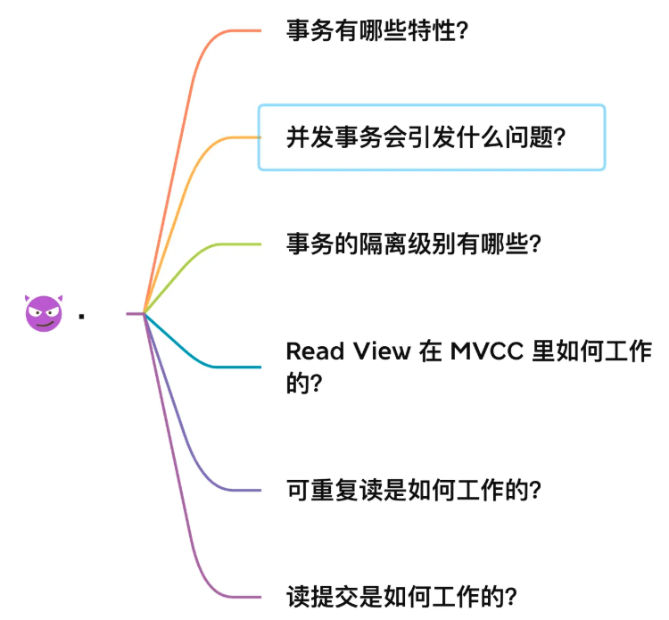

## 事务有哪些特性？

事务是由 MySQL 的引擎来实现的，我们常见的 InnoDB 引擎它是支持事务的。 MySQL 原生的 MyISAM 引擎就不支持事务

事务的**四个特性ACID**

- **原子性（Atomicity）**：一个事务中的所有操作，要么全部完成，要么全部不完成

- **一致性（Consistency）**：是指事务操作前和操作后，数据满足完整性约束，即所有的数据规则（比如唯一性约束、外键约束、业务上的逻辑约束）都不能被破坏，数据库保持一致性状态

- **隔离性（Isolation）**：每个事务都有一个完整的数据空间，不会相互干扰，对其他并发事务是隔离的

- **持久性（Durability）**：事务处理结束后，对数据的修改就是永久的，即便系统故障也不会丢失

- 持久性是通过 redo log （重做日志）来保证的；
- 原子性是通过 undo log（回滚日志） 来保证的；
- 隔离性是通过 MVCC（多版本并发控制） 或锁机制来保证的；
- 一致性则是通过持久性+原子性+隔离性来保证；
- 

## 并行事务会引发什么问题？

在同时处理多个事务的时候，就可能出现脏读（dirty read）、不可重复读（non-repeatable read）、幻读（phantom read）的问题。

### 脏读

假设有A和B这两个事务同时在处理，事务A先开始从数据库中读取小林的余额数据，然后再执行更新操作，如果此时事务A还没有提交事务，而此时正好事务B也从数据库中读取小林的余额数据，那么事务B读取到的余额数据是刚才事务A更新后的数据，即使没有提交事务。

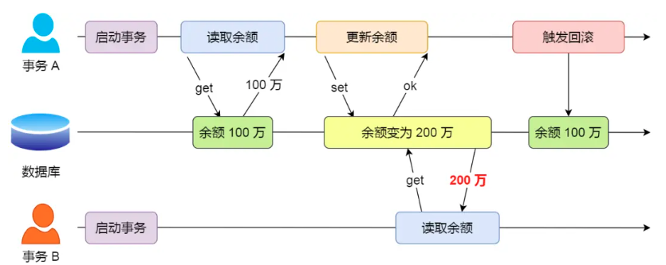

### 不可重复读

在一个事务内多次读取同一个数据，如果出现前后两次读到的数据不一样的情况，就意味着发生了「不可重复读」现象。

假设有A和B这两个事务同时在处理，事务A先开始从数据库中读取小林的余额数据，然后继续执行代码逻辑处理，在这过程中如果事务B更新了这条数据，并提交了事务，那么当事务A再次读取该数据时，就会发现前后两次读到的数据是不一致的，这种现象就被称为不可重复读。

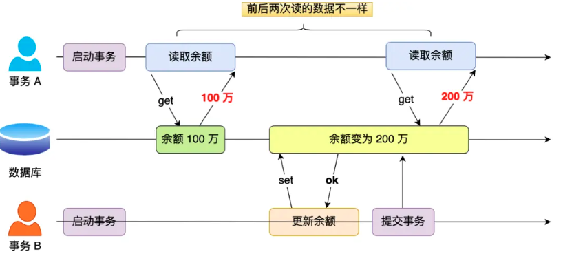

### 幻读

在一个事务内多次查询某个符合查询条件的「记录数量」，如果出现前后两次查询到的记录数量不一样的情况，就意味着发生了「幻读」现象。

假设有A和B这两个事务同时在处理，事务A先开始从数据库查询账户余额大于100万的记录，发现共有5条，然后事务B也按相同的搜索条件也是查询出了5条记录。接下来，事务A插入了一条余额超过100万的账号，并提交了事务，此时数据库超过100万余额的账号个数就变为6。然后事务B再次查询账户余额大于100万的记录，此时查询到的记录数量有6条，发现和前一次读到的记录数量不一样了，就感觉发生了幻觉一样，这种现象就被称为幻读。

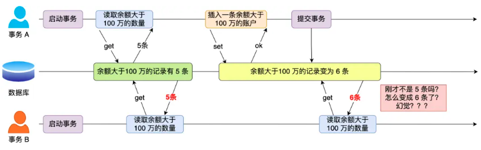

## 事务的隔离级别有哪些？

- 脏读：读到其他事务未提交的数据；

- 不可重复读：前后读取的数据不一致；

- 幻读：前后读取的记录数量不一致。

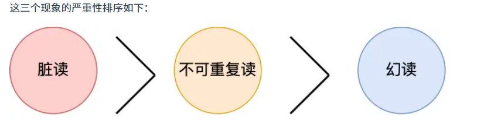

SQL 标准提出了四种隔离级别来规避这些现象，隔离级别越高，性能效率就越低

- **读未提交（read uncommitted）**，指一个事务还没提交时，它做的变更就能被其他事务看到；

- **读已提交（read committed）**，指一个事务提交之后，它做的变更才能被其他事务看到

- **可重复读（repeatable read）**，指一个事务执行过程中看到的数据，跟这个事务启动时看到的数据是一致的，**MySQL InnoDB 引擎的默认隔离级别**

- **串行化（\*serializable\* ）**；会对记录加上读写锁，在多个事务对这条记录进行读写操作时，如果发生了读写冲突的时候，后访问的事务必须等前一个事务执行完成，才能继续执行；

按隔离水平高低排序如下：

针对不同的隔离级别，并发事务时可能发生的现象也会不同。

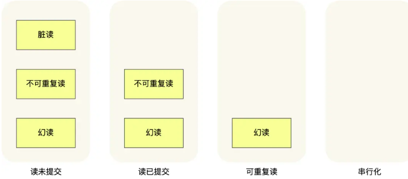

MySQL 在「可重复读」隔离级别下，可以**很大程度上避免幻读**现象的发生，所以 MySQL 并不会使用「串行化」隔离级别来避免幻读现象的发生，因为使用「串行化」隔离级别会影响性能。

**MySQL InnoDB 引擎的默认隔离级别虽然是「可重复读」，但是它很大程度上避免幻读现象（并不是完全解决了）**，解决的方案有两种：

- 针对**快照读**（普通 select 语句），是**通过 MVCC 方式解决了幻读**，因为可重复读隔离级别下，事务执行过程中看到的数据，一直跟这个事务启动时看到的数据是一致的，即使中途有其他事务插入了一条数据，是查询不出来这条数据的，所以就很好了避免幻读问题。

- 针对**当前读**（select ... for update 等语句），是**通过 next-key lock（记录锁+间隙锁）方式解决了幻读**，因为当执行 select ... for update 语句的时候，会加上 next-key lock，如果有其他事务在 next-key lock 锁范围内插入了一条记录，那么这个插入语句就会被阻塞，无法成功插入，所以就很好了避免幻读问题。

这四种隔离级别具体是如何实现的呢

- 对于「读未提交」隔离级别的事务来说，因为可以读到未提交事务修改的数据，所以直接读取最新的数据就好了；

- 对于「串行化」隔离级别的事务来说，通过加读写锁的方式来避免并行访问；
- 对于「读提交」和「可重复读」隔离级别的事务来说，它们是通过  **Read View **来实现的，它们的区别在于创建 Read View 的时机不同，大家可以把 Read View 理解成一个数据快照，就像相机拍照那样，定格某一时刻的风景。**「读提交」隔离级别是在「每个语句执行前」都会重新生成一个 Read View，而「可重复读」隔离级别是「启动事务时」生成一个 Read View，**然后整个事务期间都在用这个 Read View。

注意，执行「开始事务」命令，并不意味着启动了事务。在 MySQL 有两种开启事务的命令，分别是：

- 第一种：begin/start transaction 命令；

- 第二种：start transaction with consistent snapshot 命令；

这两种开启事务的命令，事务的启动时机是不同的：

- 执行了 begin/start transaction 命令后，并不代表事务启动了。只有在执行这个命令后，执行了第一条select 语句，才是事务真正启动的时机；

- 执行了 start transaction with consistent snapshot 命令，就会马上启动事务。

## Read View 在 MVCC 里如何工作的？

Read View是MVCC 的核心大脑，当你的事务开始执行查询（`SELECT`）时，InnoDB 会立刻按下快门，拍下一张“当前数据库所有活跃事务”的快照。这张快照就是 Read View。

### 1. 什么是 Read View？

当你的事务开始执行查询（`SELECT`）时，InnoDB 会立刻按下快门，拍下一张“当前数据库所有活跃事务”的快照。这张快照就是 Read View。

这张快照里，不存具体的数据，只存了 **4 个极其重要的变量（事务 ID）**：

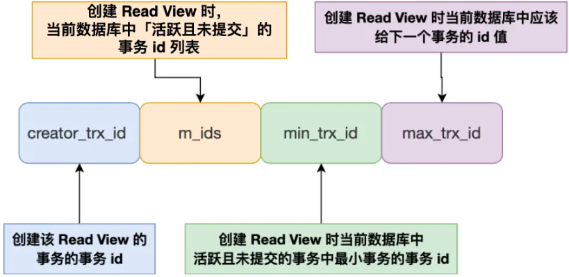

1. **`creator_trx_id` (我自己的 ID)**：拍下这张照片的事务 ID（也就是你当前的事务）。
2. **`m_ids` (活跃黑名单)**：按下快门那一刻，数据库里**所有正在运行且尚未提交**的事务 ID 列表。
3. **`min_trx_id` (最小黑名单 ID)**：`m_ids` 列表里最小的那个 ID。
4. **`max_trx_id` (未来 ID)**：系统即将分配给**下一个**新事务的 ID（也就是当前最大事务 ID + 1）。

------

### 2. 隐藏的“包裹单” (版本链)

在讲判定规则前，你还需要复习一个隐藏设定： 每一行数据（User Record）除了真实数据外，还有两个隐藏列：

- **`trx_id`**：最后一个修改这行数据的事务 ID。
- **`roll_pointer`**：回滚指针，指向 Undo Log 里这行数据的上一个历史版本。这就形成了一个**版本链**。

------

### 3. Read View 的“四步判定法” (核心算法)

现在，你（带着你的 Read View 照片）来到了一行数据面前，这行数据上写着最后修改它的事务 ID：`trx_id`。

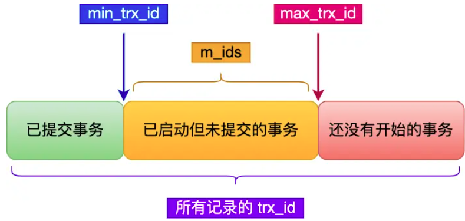

你到底能不能看这行数据？InnoDB 会严格按照以下 4 条规则进行判定：

> **规则 1：是不是我自己改的？**
>
> - **判断**：如果这行数据的 `trx_id == creator_trx_id`。
> - **结果**：**可见！** 自己改的数据，自己当然有权看。

> **规则 2：是不是早就盖棺定论的老数据？**
>
> - **判断**：如果 `trx_id < min_trx_id`。
> - **结果**：**可见！** 说明改这行数据的事务，在我拍照（生成 Read View）之前就已经提交结束了。历史已成定局，完全可以看。

> **规则 3：是不是未来的穿越者改的？**
>
> - **判断**：如果 `trx_id >= max_trx_id`。
> - **结果**：**不可见！** 说明改这行数据的事务，是在我拍照**之后**才开启的。我不能看未来的东西。

> **规则 4：是不是正在跟我同时进行的并发事务改的？**
>
> - **判断**：如果 `min_trx_id <= trx_id < max_trx_id`。这个时候情况最复杂，必须去翻看 **`m_ids` (活跃黑名单)**。
>   - **如果在黑名单里 (`trx_id` ∈ `m_ids`)**：**不可见！** 说明我拍照时，这个事务还没提交（正在疯狂改数据）。为了防止“脏读”，我绝不能看。
>   - **如果不在黑名单里 (`trx_id` ∉ `m_ids`)**：**可见！** 说明虽然它的 ID 处于中间地带，但在我拍照前，它刚好“压哨提交”了，所以它不在活跃黑名单里。已经提交的数据，可以看。

如果根据上述规则，当前版本的数据对你“不可见”，InnoDB 就会顺着隐藏的 **`roll_pointer`** 去 Undo Log 里把上一个历史版本翻出来，把上一个版本的 `trx_id` 拿出来，**重新过一遍这 4 条规则**。 一直顺藤摸瓜，直到找到一个对你可见的版本为止！

## 可重复读是如何工作的？

**可重复读隔离级别是启动事务时生成一个 Read View，然后整个事务期间都在用这个 Read View**。

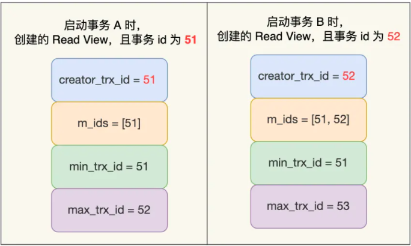

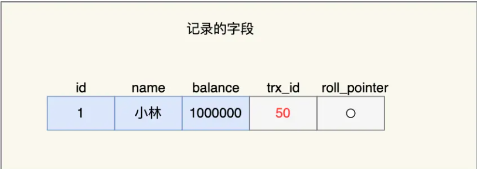

在可重复读隔离级别下，事务 A 和事务 B 按顺序执行了以下操作：

事务 B 第一次读小林的账户余额记录，在找到记录后，它会先看这条记录的 trx_id，此时发现 trx_id 为50，比事务 B 的 Read View 中的 **min_trx_id 值（51）还小**，这意味着修改这条记录的事务早就在事务 B 启动前提交过了，所以该版本的记录对事务 B 可见的，也就是事务 B 可以获取到这条记录。

接着，事务 A 通过 update 语句将这条记录修改了（还未提交事务），将小林的余额改成 200 万，这时 MySQL 会记录相应的 undo log，并以链表的方式串联起来，形成**版本链**，如下图：

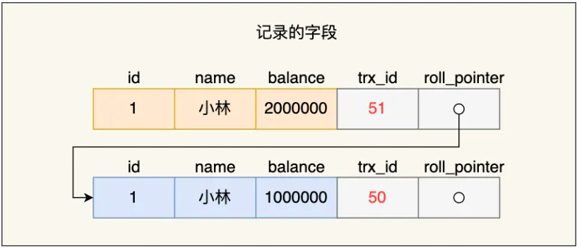

在上图的「记录的字段」看到，由于事务 A 修改了该记录，以前的记录就变成旧版本记录了，于是最新记录和旧版本记录通过链表的方式串起来，而且最新记录的 trx_id 是事务 A 的事务 id（trx_id = 51）。

然后事务 B 第二次去读取该记录，发现这条记录的 trx_id 值为 51，在事务 B 的 Read View 的 min_trx_id 和 max_trx_id 之间，则需要判断 trx_id 值是否在 m_ids 范围内，判断的结果是在的，那么说明这条记录是被还未提交的事务修改的，这时事务 B 并不会读取这个版本的记录。而是沿着 undo log 链条往下找旧版本的记录，直到找到 trx_id 「小于」事务 B 的 Read View 中的 min_trx_id 值的第一条记录，所以事务B 能读取到的是 trx_id 为 50 的记录，也就是小林余额是 100 万的这条记录。

最后，当事物 A 提交事务后，事务 B 第三次读取记录时，读到的记录还是基于启动事务时创建的 Read View 来判断的当前版本的记录，是 100 万

## 读提交是如何工作的？

**读提交隔离级别是在每次读取数据时，都会生成一个新的 Read View**。

事务 B 在找到小林这条记录时，会看这条记录的 trx_id 是 51，在事务 B 的 Read View 的 min_trx_id 和 max_trx_id 之间，接下来需要判断 trx_id 值是否在 m_ids 范围内，判断的结果是在的，那么说明**这条记录是被还未提交的事务修改的**，**这时事务 B 并不会读取这个版本的记录**。而是，沿着 undo log 链条往下找旧版本的记录，直到找到 trx_id「小于」事务 B 的 Read View 中的 min_trx_id 值的第一条记录，所以事务 B 能读取到的是 trx_id 为 50 的记录，也就是小林余额是 100 万的这条记录。

在事务 A 提交后，由于隔离级别是「读提交」，所以事务 B 在每次读数据的时候，会重新创建 Read View，此时事务 B 第三次读取数据时创建的 Read View 如下。事务 B 在找到小林这条记录时，会发现这条记录的 trx_id 是 51，比事务 B 的 Read View 中的 min_trx_id 值（52）还小，这意味着修改这条记录的事务早就在创建 Read View 前提交过了，所以该版本的记录对事务 B 是可见的。

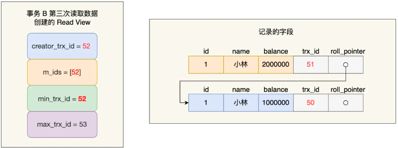

## 总结

事务是在 MySQL 引擎层实现的，我们常见的 InnoDB 引擎是支持事务的，事务的四大特性是原子性、一致性、隔离性、持久性，我们这次主要讲的是隔离性。

当多个事务并发执行的时候，会引发**脏读、不可重复读、幻读**这些问题，那为了避免这些问题，SQL 提出了四种隔离级别，分别是**读未提交、读已提交、可重复读、串行化**，从左往右隔离级别顺序递增，隔离级别越高，意味着性能越差，**InnoDB 引擎的默认隔离级别是可重复读。**

要解决脏读现象，就要将隔离级别升级到读已提交以上的隔离级别，要解决不可重复读现象，就要将隔离级别升级到可重复读以上的隔离级别。

而对于幻读现象，不建议将隔离级别升级为串行化，因为这会导致数据库并发时性能很差。**MySQL InnoDB 引擎的默认隔离级别是「可重复读」，但是它很大程度上避免幻读现象（并不是完全解决了）**，解决的方案有两种：

- 针对**快照读**（普通 select 语句），是**通过 MVCC 方式解决了幻读**，因为可重复读隔离级别下，事务执行过程中看到的数据，一直跟这个事务启动时看到的数据是一致的，即使中途有其他事务插入了一条数据，是查询不出来这条数据的，所以就很好了避免幻读问题。

- 针对**当前读**（select ... for update 等语句），是**通过 next-key lock（记录锁+间隙锁）方式解决了幻读**，因为当执行 select ... for update 语句的时候，会加上 next-key lock，如果有其他事务在 next-key lock 锁范围内插入了一条记录，那么这个插入语句就会被阻塞，无法成功插入，所以就很好了避免幻读问题。

对于「读提交」和「可重复读」隔离级别的事务来说，它们是通过 Read View 来实现的，它们的区别在于创建 Read View 的时机不同：

- 「读提交」隔离级别是在每个 select 都会生成一个新的 Read View

- 「可重复读」隔离级别是启动事务时生成一个 Read View，然后整个事务期间都在用这个 Read View

这两个隔离级别实现是通过「事务的 Read View 里的字段」和「记录中的两个隐藏列」的比对，来控制并发事务访问同一个记录时的行为，这就叫 **MVCC（多版本并发控制）。**