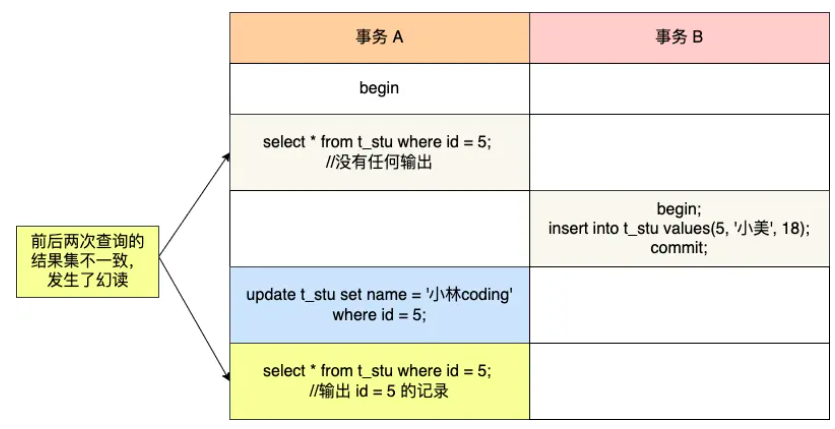

## 什么是幻读？

当同一个查询在不同的时间产生不同的结果集时，事务中就会出现所谓的幻象问题。例如 SELECT 执行了两次，但第二次返回了第一次没有返回的行，则该行是“幻像”行。

## 快照读是如何避免幻读的？

可重复读隔离级是由 MVCC（多版本并发控制）实现的，实现的方式是开始事务后（执行 begin 语句后），在执行第一个查询语句后，会创建一个 Read View，后续的查询语句利用这个 Read View，通过这个 Read View 就可以在 undo log 版本链找到事务开始时的数据，所以事务过程中每次查询的数据都是一样的，即使中途有其他事务插入了新纪录，是查询不出来这条数据的，所以就很好了避免幻读问题。

## 当前读是如何避免幻读的？

**Innodb 引擎为了解决「可重复读」隔离级别使用「当前读」而造成的幻读问题，就引出了next-key lock**。

然后，事务 B 在执行插入语句的时候，判断到插入的位置被事务 A 加了 next-key lock，于是事务 B 会生成一个插入意向锁，同时进入等待状态，直到事务 A 提交了事务。这就避免了由于事务 B 插入新记录而导致事务 A 发生幻读的现象

## 幻读被完全解决了吗？

可重复读隔离级别下虽然很大程度上避免了幻读，但是还是没有能完全解决幻读

### 第一个发生幻读现象的场景

`UPDATE` 语句是绝对不认 MVCC 的快照的。它叫**当前读 (Current Read)**，它必须去磁盘里找此时此刻**最新**的、已经提交的数据。

### 第二个发生幻读现象的场景

- T1 时刻：事务 A 先执行「快照读语句」：select * from t_test where id > 100 得到了 3 条记录。

- T2 时刻：事务 B 往插入一个 id= 200 的记录并提交；

- T3 时刻：事务 A 再执行「当前读语句」select * from t_test where id > 100 for update 就会得到 4 条记录，此时也发生了幻读

## 总结

MySQL InnoDB 引擎的可重复读隔离级别（默认隔离级），根据不同的查询方式，分别提出了避免幻读的方案：

- 针对**快照读**（普通 select 语句），是通过 MVCC 方式解决了幻读。

- 针对**当前读**（select ... for update 等语句），是通过 next-key lock（记录锁+间隙锁）方式解决了幻读。

举例了两个发生幻读场景的例子说明，**MySQL 可重复读隔离级别并没有彻底解决幻读，只是很大程度上避免了幻读现象的发生。**

要避免这类特殊场景下发生幻读的现象的话，尽量在开启事务之后，**马上执行 select ... for update 这类当前读的语句**，因为它会对记录加 next-key lock，从而避免其他事务插入一条新记录。