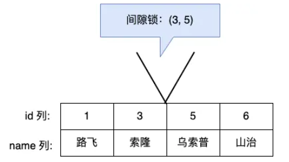
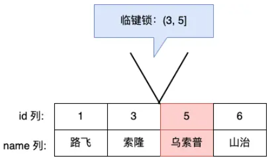

# MySQL 是怎么加锁的？

## 什么 SQL 语句会加行级锁？

如果要在查询时对记录加行级锁，可以使用下面这两个方式，这两种查询会加锁的语句称为**锁定读**。

```sql
//对读取的记录加共享锁(S型锁)
select ... lock in share mode;
//对读取的记录加独占锁(X型锁)
select ... for update;
```

在使用这两条语句的时候，要加上 begin 或者 start transaction 开启事务的语句。**当事务提交锁才会被释放**

update 和 delete 操作都会加行级锁，且锁的类型都是独占锁(X型锁)。

```sql
//对操作的记录加独占锁(X型锁)
update table .... where id = 1;
//对操作的记录加独占锁(X型锁)
delete from table where id = 1;
```


## 行级锁有哪些种类？

在读已提交隔离级别下，行级锁的种类只有记录锁

在可重复读隔离级别下，行级锁的种类有记录锁、间隙锁

### 记录锁 Record Lock

举个例子，当一个事务执行了下面这条语句：

```sql
mysql > begin;
mysql > select * from t_test where id = 1 for update;
```

事务会对表中主键 id = 1 的这条记录加上 X 型的记录锁.这时候其他事务对这条记录进行删除或者更新操作，那么这些操作都会被阻塞。

当事务执行 commit 后，事务过程中生成的锁都会被释放。

### 间隙锁 Gap Lock

假设表中有一个范围 id 为（3，5）间隙锁，那么其他事务就无法插入 id = 4 这条记录了，有效的防止幻读现象的发生。



间隙锁虽然存在 X 型间隙锁和 S 型间隙锁，但是并没有区别。**间隙锁之间是兼容的，即两个事务可以同时持有包含共同间隙范围的间隙锁**

### 临键锁 Next-Key Lock

这是 Record Lock + Gap Lock 的组合，锁定一个范围，并且锁定记录本身

假设表中有一个范围 id 为（3，5] 的 next-key lock，那么其他事务即不能插入 id = 4 记录，也不能修改和删除 id = 5 这条记录。



next-key lock 即能保护该记录，又能阻止其他事务将新记录插入到被保护记录前面的间隙中。


## MySQL 是怎么加行级锁的？

### 唯一索引（主键索引）等值查询